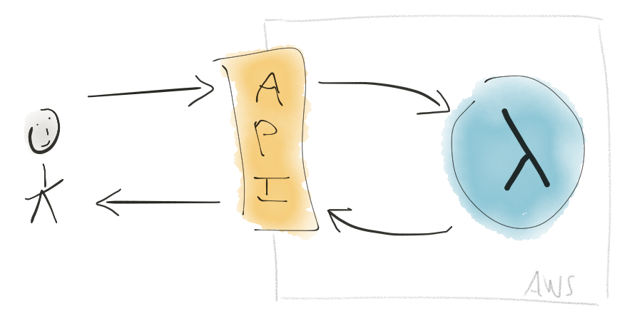
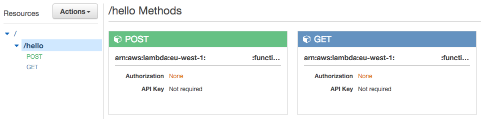

Hello (AWS) Lambda with Terraform
=================================

[](https://circleci.com/gh/TailorDev/hello-lambda)

This project is an example of a Python (AWS)
[Lambda](https://aws.amazon.com/lambda/) exposed with [API
Gateway](https://aws.amazon.com/api-gateway/), configured with
[Terraform](https://www.terraform.io/). This demo project is related to the
following blog post: [A Tour of AWS
Lambda](https://tailordev.fr/blog/2016/07/08/a-tour-of-aws-lambda/).





## Introduction

This demo project creates a `/hello` endpoint with two methods (`GET` and
`POST`). Both methods are bound to a **single file** containing two handlers
(a.k.a. lambda functions, one for each method). This is defined by a `handler`
parameter. The code for each lambda function is written in Python (method names
are just a convention):

```python
def handler(event, context):
    return { "message": "Hello, World!" }

def post_handler(event, context):
    return { "message": "I should have created something..." }
```

The [Terraform configuration](hello_lambda.tf) relies on two modules:
[`lambda`](lambda/) and [`api_method`](api_method/). See the [Terraform Modules
section](#terraform-modules) for further information. This configuration creates
two lambda functions on AWS Lambda, a (deployed) REST API with a single endpoint
and two HTTP methods on API Gateway, and takes care of the permissions and
credentials. The figure below is an example of what you get in the API Gateway
dashboard:




## Getting started

You must have an [AWS account](http://aws.amazon.com/). Next, you must [install
Terraform](https://www.terraform.io/intro/getting-started/install.html) first.

Clone this repository, then run:

    $ make bootstrap

Create a `terraform.tfvars` file with the content below. This step is optional
as Terraform will ask you to fill in the different values, but it is convenient.

```ini
aws_account_id = "account-id"
aws_access_key = "access-key"
aws_secret_key = "secret-key"
aws_region     = "eu-west-1"
```

You are now ready to use Terraform!

    $ terraform plan

If everything is OK, you can build the whole infrastructure:

    $ terraform apply

You can destroy all the components by running:

    $ terraform destroy

For more information, please read [the Terraform
documentation](https://www.terraform.io/docs/index.html).


## Terraform Modules

### `lambda`

```hcl
module "lambda" {
  source  = "github.com/TailorDev/hello-lambda/lambda"
  name    = "my-lambda"
  handler = "handler"
  runtime = "python2.7" # could be nodejs | nodejs4.3 | java8 | python2.7
  role    = "my-role"
}
```

**Important:** this module assumes that the source file, the lambda (in AWS),
and the zip file have the **same name**. For example, we use `hello_lambda` in
this project. The `handler` parameter distinguishes the different lambda
functions that can be invoked.

### `api_method`

```hcl
module "hello_post" {
  source      = "github.com/TailorDev/hello-lambda/api_method"
  rest_api_id = "rest-api-id"
  resource_id = "resource-id"
  method      = "POST"
  path        = "resource-path"
  lambda      = "my-lambda"
  region      = "eu-west-1"
  account_id  = "account-id"
}
```


## License

This project and its Terraform modules are released under the MIT License. See
the bundled [LICENSE](LICENSE.md) file for details.
